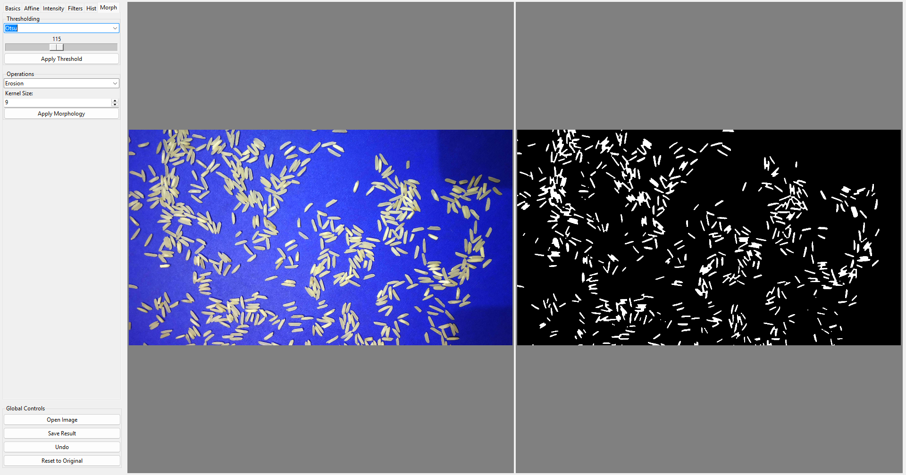

# Image Processing Desktop Application

This desktop application is designed to demonstrate and apply fundamental digital image processing techniques using Python. It features a user interface built with Tkinter, allowing users to manipulate images using OpenCV and visualize the results side-by-side with the original image.

## Features

The tool includes the following processing modules:

### 1. Basic Operations
* **Grayscale Conversion:** Converts the input image to grayscale.
* **Flipping:** Supports both horizontal and vertical image flipping.

### 2. Affine Transformations
* **Rotation:** Rotates the image by a custom angle specified by the user.
* **Scaling:** Resizes the image using independent X and Y scaling factors.
* **Translation:** Shifts the image position along the X and Y axes.
* **Shear:** Applies shear mapping to distort the image geometry.

### 3. Intensity Adjustments
* **Contrast Stretching:** Automatically enhances the contrast range of the image.
* **Negative:** Inverts pixel values to create a negative effect.
* **Gamma Correction:** Applies non-linear brightness adjustment using a configurable slider (values range from 0.1 to 5.0).

### 4. Spatial Filters
* **Smoothing:** Includes Mean (Box), Gaussian, and Median filters for noise reduction.
* **Edge Detection:** Implements Laplacian, Sobel X, and Sobel Y operators.
* **Kernel Customization:** Users can define custom kernel sizes (e.g., 3x3, 5x5, 7x7) for all filter operations.

### 5. Histogram Processing
* **Visualization:** Generates and displays the color or grayscale histogram of the current image in a separate pop-up window using Matplotlib.
* **Equalization:** Applies Histogram Equalization to improve global contrast.

### 6. Morphological Operations
* **Thresholding:** Supports both automatic thresholding (Otsu's Method) and manual global thresholding via a slider.
* **Morphology:** Performs standard operations including Erosion, Dilation, Opening, and Closing. (Note: Uses a rectangular structuring element).

## Known Limitations

* **Performance:** Processing high-resolution images may cause temporary UI freezes during computationally expensive operations (e.g., Median Filtering).
* **Memory:** The Undo stores copies of the image in memory; extensive editing sessions on large files may increase RAM usage.
* **Kernel Shapes:** Morphological operations currently utilize a fixed rectangular kernel shape.

### Requirements

* `opencv-python`
* `numpy`
* `matplotlib`
* `Pillow`
